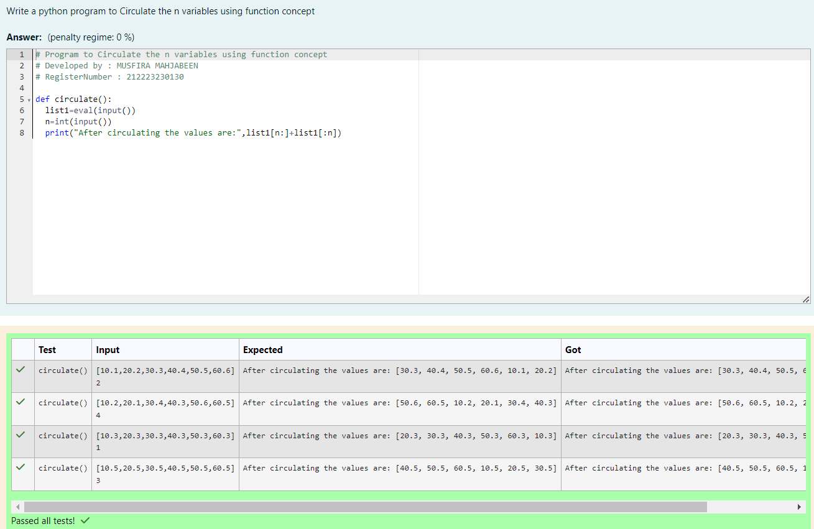

# Circulate-the-values-of-N-variables

## Aim:

To write a python program to circulate the n variables using function concept

## Equipment’s required:

PC
Anaconda - Python 3.7

## Algorithm:

### Step 1:

Define a function.

### Step 2:

Get the list from the user.

### Step 3:

Get the value from the user for the number of rotation

### Step 4:

Using the slicing concept rotate the list

### Step 5:

Print the list.

### Step 6:

End the program

## Program:

```python
# Program to Circulate the n variables using function concept
# Developed by : MUSFIRA MAHJABEEN
# RegisterNumber : 212223230130

def circulate():
  list1=eval(input())
  n=int(input())
  print("After circulating the values are:",list1[n:]+list1[:n])

```

## Output:



## Result:

Thus the program to circulate the n variables using function is written and verified using python programming.
